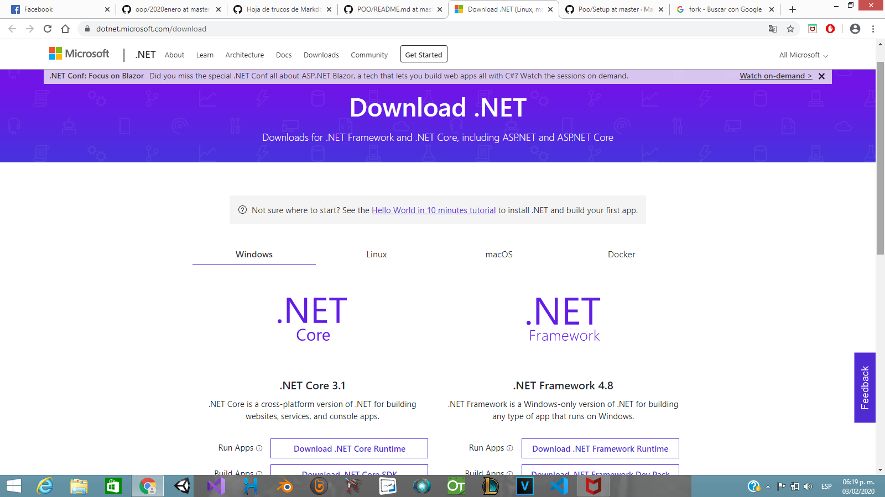
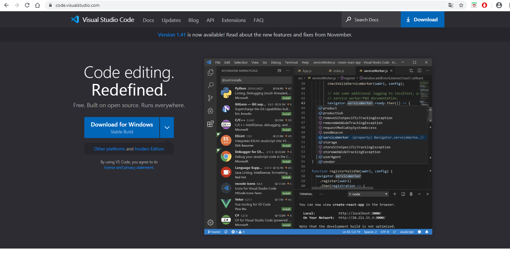
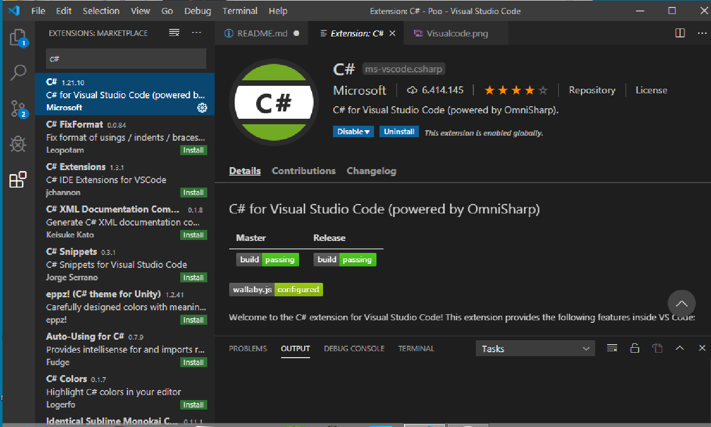
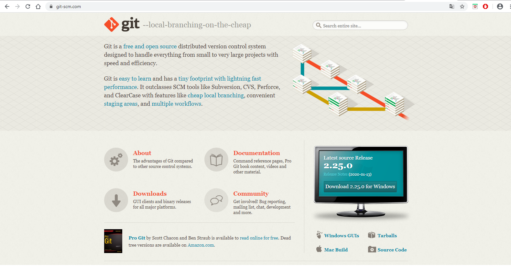

# Ejercicio de markdown

# Instalación de dotnet core 2.2.
Lo primero que tenemos que hacer es bajar el archivo de instalacion del siguiente [lugar](https://dotnet.microsoft.com/download/dotnet-core/3.0).
Es importante bajar el SDK porque *vamos a programar*.

La pagina se ve  asi:

Busca la version 3.1, descarga e instala aceptando los terminos para aplicaciones Build Apps. 

# Instalación y configuración de Visual Studio Code para C#.
Para realizar la instalacion de Visual Studio Code, primeramente debes de ir a la siguiente [Pagina](https://code.visualstudio.com/)

Intalamos directamente para *Empezar a programar*

La pagina la puedes encontrar de esta manera

Descargamos, instalamos para poder iniciar con la programacion, despues vamos a instalar la extencion para el lenguaje de programacion c#, abrimos el programa, nos dirijimos a extensiones buscamos la extension c#

Lo podras encontrar de esta forma

# Instalación de git. conectado a tu cuenta de GitHub y VSC.

Empezamos ahora con el programa git que es un sofware para control de versiones, primeramente tenemos que dirigirnos a la suguiente [Pagina](https://git-scm.com/)

La pagina se ve de esta manera

Le damos directo en la opcion de descarga, esperamos a que se descargue el instalador y empezamos a instalar el sofware, aceptamos los terminos y le damos en siguiente en todas las pestañas indicadas, al finalizar podremos utilizar esta herramienta correctmente

# Ejercicio de markdown

# Instalación de dotnet core 2.2.
Lo primero que tenemos que hacer es bajar el archivo de instalacion del siguiente [lugar](https://dotnet.microsoft.com/download/dotnet-core/3.0).
Es importante bajar el SDK porque *vamos a programar*.

La pagina se ve  asi:

Busca la version 3.1, descarga e instala aceptando los terminos para aplicaciones Build Apps. 

# Instalación y configuración de Visual Studio Code para C#.
Para realizar la instalacion de Visual Studio Code, primeramente debes de ir a la siguiente [Pagina](https://code.visualstudio.com/)

Intalamos directamente para *Empezar a programar*

La pagina la puedes encontrar de esta manera

Descargamos, instalamos para poder iniciar con la programacion, despues vamos a instalar la extencion para el lenguaje de programacion c#, abrimos el programa, nos dirijimos a extensiones buscamos la extension c#

Lo podras encontrar de esta forma

# Instalación de git. conectado a tu cuenta de GitHub y VSC.

Empezamos ahora con el programa git que es un sofware para control de versiones, primeramente tenemos que dirigirnos a la suguiente [Pagina](https://git-scm.com/)

La pagina se ve de esta manera

Le damos directo en la opcion de descarga, esperamos a que se descargue el instalador y empezamos a instalar el sofware, aceptamos los terminos y le damos en siguiente en todas las pestañas indicadas, al finalizar podremos utilizar esta herramienta correctmente